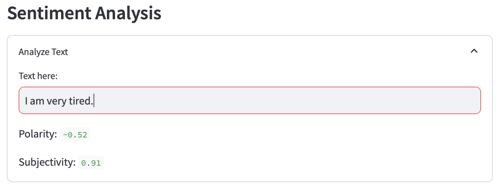
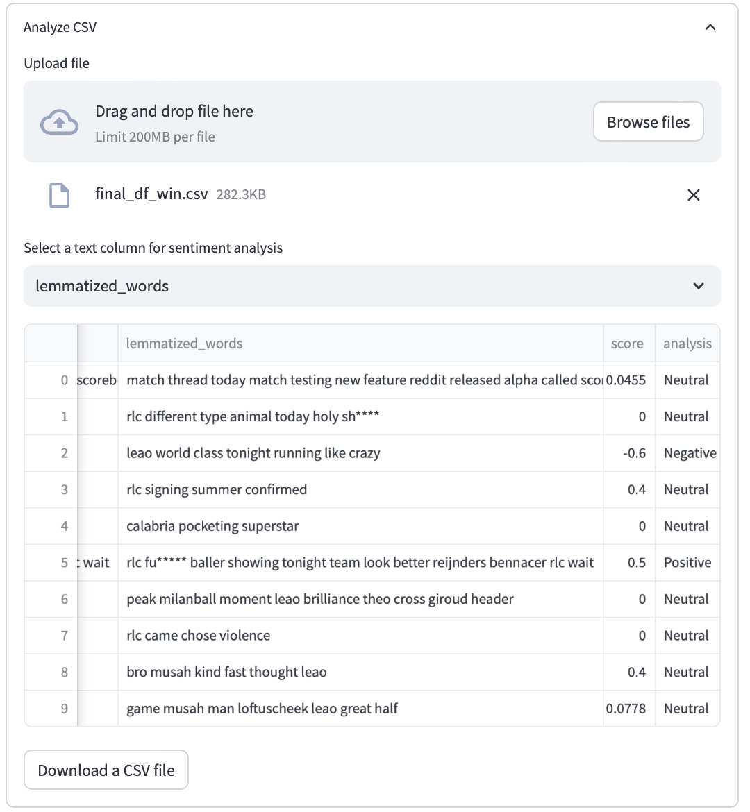
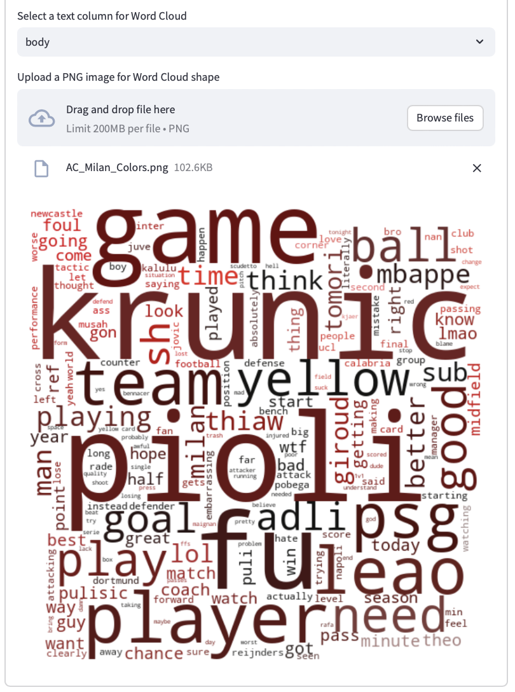

# The Results of the Streamlit App Usage

Here I just paste screenshots of the streamlit app to show you how it generally works.

## Starting Page

Here you can basically see all the sections of the app:

## Analyze Text Section

We can check that the sentiment analysis of a custom text works:

## Analyze CSV Section

Here is how we can analyze CSV file. We can choose the file, column name, and also download the CSV file with the results.

As we can see, not all of the comments have correct sentiment score, but i think that it has more to do with the machine that do not unserstand football slang.

## WordCloud

Lastly, there are two wordclouds that appear after we use the Streamlit App:

When Milan won:

And when it lost:

**THAT IS IT!**
